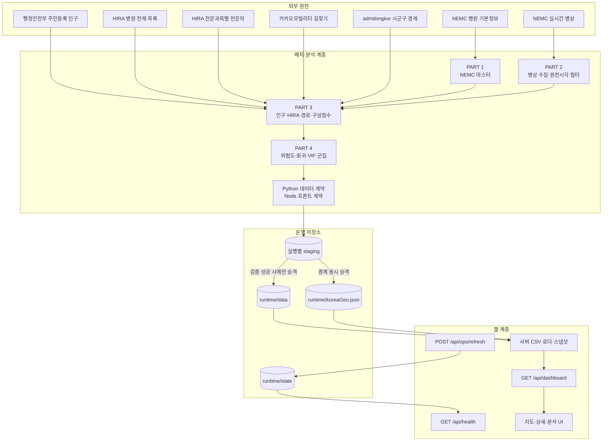
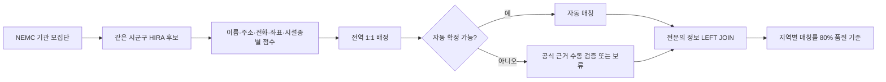
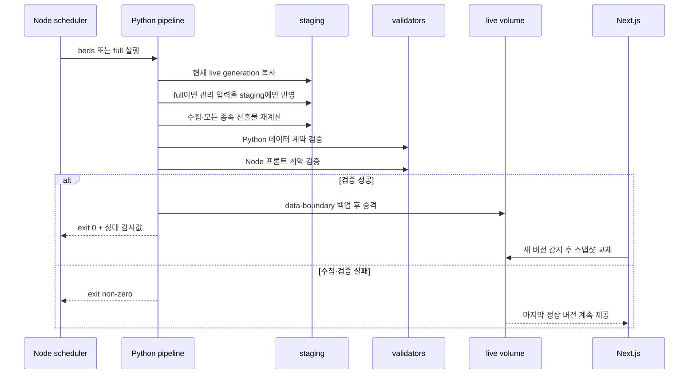
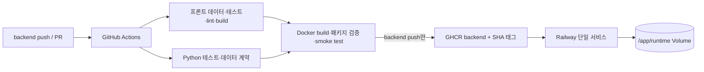

# 시스템 아키텍처

이 문서는 Emergency Medical Capacity Dashboard의 프론트엔드, 데이터 분석, 백엔드, 동적 배포가 어떻게 하나의 운영 흐름으로 연결되는지 설명합니다. 원천별 수집·결측 처리와 데이터 계보는 [DATA_PIPELINE.md](./DATA_PIPELINE.md), 실행 명령과 Railway 설정값은 [README.md](./README.md)와 [DEPLOYMENT.md](./DEPLOYMENT.md)를 함께 참고합니다.

## 1. 설계 목표

- NEMC를 기준 모집단으로 유지하면서 HIRA·인구·도로 접근성을 보강한다.
- 원천 결측이나 오래된 관측값을 0으로 바꾸지 않고 산출 상태로 드러낸다.
- 수집, 분석, 화면이 동일한 데이터 계약과 위험등급 기준을 사용한다.
- 배치 도중 실패해도 마지막 검증 완료 데이터를 계속 제공한다.
- API 키는 브라우저 번들과 Git 이력에 포함하지 않는다.
- 배포 이미지와 로컬 재현 환경이 같은 Python·Node 의존성을 사용한다.

## 2. 전체 구조



## 3. 계층별 책임

### 프론트엔드

- `src/app/page.js`: 대시보드 진입점
- `src/components/MapTab.jsx`, `KoreaMap.jsx`: 시군구 위험도 지도와 탐색
- `RegionPopup.jsx`, `HospitalPopup.jsx`: 지역·병원 단위 근거 데이터 표시
- `AnalyticsTab.jsx`: 상관관계, 구성요인, 군집 분석 화면
- `DashboardLoader.jsx`: `/api/dashboard`를 주기적으로 확인하고 데이터 버전이 바뀔 때 갱신
- `src/lib/riskScale.js`: 백엔드 CSV와 공유하는 위험등급 경계

브라우저는 CSV 파일이나 API 키에 직접 접근하지 않습니다. Next.js 서버가 검증 산출물을 읽어 화면 계약에 맞는 JSON 스냅샷을 제공합니다.

### 백엔드 API와 런타임

| 엔드포인트 | 역할 |
|---|---|
| `GET /api/dashboard` | 현재 검증 스냅샷 제공, ETag와 데이터 버전 지원 |
| `GET /api/health` | 데이터 신선도, 만료 병상, 파이프라인 상태 제공 |
| `POST /api/ops/refresh` | Bearer 토큰으로 `beds` 또는 `full` 갱신 요청 접수 |

`scripts/start_dynamic.mjs`는 Next.js 서버와 Python 자식 프로세스를 함께 관리합니다. 스케줄러는 한 번에 하나의 갱신만 실행하고, 중복 요청은 단일 대기 작업으로 합칩니다. Railway에서 스케줄러를 켤 때는 영속 Volume과 단일 replica가 필수입니다.

### 데이터 파이프라인

| 단계 | 주요 스크립트 | 결과 |
|---|---|---|
| 기관 모집단 | `part1_collect_hospital_master.py` | 현재 NEMC 기관 모집단과 지역·좌표 |
| 실시간 병상 | `part2_collect_bed_status.py` | 가용·전체 병상, 포화율, 수집·원천 기준시각 |
| 인구 | `part3_collect_population.py`, `part3_prepare_population.py` | 최신 공표 월의 시군구 인구 |
| 의료진 | `part3_collect_hira_doctors.py` | HIRA 병원 1:1 매칭과 응급의학과 전문의 |
| 접근성 | `update_boundaries.mjs`, `part3_collect_kakao_routes.py` | 경계 대표점과 자동차 최단 경로 |
| 점수·분석 | `part3_build_component_scores.py`, `part3_calculate_region_risk.py`, `part4_analyze.py` | 구성점수, 위험도, 회귀·VIF·군집 |
| 결측 추적 | `build_missingness_report.py` | 지역·병원 결측 원인, 우선순위, 다음 조치와 요약 |
| 계약 검증 | `validate_data_contract.py`, `validate_frontend_data.mjs` | 모집단·결측·경계·프론트 입력 계약 |

## 4. 모집단과 매칭 정책

분석 모집단의 기준은 NEMC입니다. HIRA 식별자는 NEMC `hpid`와 직접 호환되지 않으므로 이름만 검색해 붙이지 않습니다.



- 동일 HIRA 식별자를 두 NEMC 기관에 배정하지 않습니다.
- 수동 매칭은 `hira_match_overrides.csv`에 공식 근거 URL과 확인일을 남깁니다.
- 매칭 실패는 전문의 0명을 의미하지 않습니다.
- HIRA 보강에 실패해도 NEMC 기관은 병상·접근성 모집단에서 제거하지 않습니다.
- 지역별 HIRA 매칭률이 80% 미만이면 의료진 점수를 산출하지 않습니다.

## 5. 위험도와 데이터 신뢰성

```text
regionRisk =
    0.35 × 병상포화도점수
  + 0.30 × 접근성점수
  + 0.20 × 인구대비병상점수
  + 0.15 × 의료진부족점수
```

네 항목이 모두 존재할 때만 최종 점수를 계산합니다. 모집단·완료·최근 계산·만료 지역 수는 배치마다 달라지므로 `/api/health`의 `regions`, `completeRegions`, `scoredRegions`, `expiredScoreRegions`를 기준으로 확인합니다. 이 값은 의료적 진단이나 이송 지시가 아니라 데이터 기반 지역 비교 지표입니다.

신뢰성 방어선은 다음과 같습니다.

- NEMC 기관 수, 지역 수, HIRA 매칭 수, 병상 유효 기관 수가 검토 기준보다 급감하면 승격을 중단합니다.
- 전체병상 0·누락, 음수 가용병상, 계산식과 맞지 않는 포화율은 유효값으로 사용하지 않습니다.
- 병원이 보고한 `API기준시각`이 운영 기준 12시간보다 오래되면 병상값을 결측 처리합니다.
- HIRA 자동 매칭이 애매한 기관은 억지로 연결하지 않고 감사 CSV에 후보와 사유를 남깁니다.
- 병상·지역 위험도·HIRA 결측은 매 갱신에서 `missingness_followup.csv`로 재생성하고 현재 원천과 다르면 승격을 중단합니다.
- 최신 경계와 NEMC 지역이 완전한 1:1 관계가 아님을 명시하고, 상위 시 집계와 기관 없는 경계를 구분합니다.
- 카카오 성공 경로는 요청 키와 TTL로 캐시하며 좌표·경계가 바뀌면 다시 조회합니다.

서버 스냅샷은 현재 운영값과 최근 계산값을 구분합니다. 현재 시각에 병상 유효기간이 지난 지역은 메인 지도와 상세에서 위험도를 마스킹합니다. 다만 마지막 계산 결과 자체는 `analysisSnapshot`에 계산시각, 현재 만료 여부와 계산 당시 원천정책 충족 여부를 붙여 분석 화면에서 참고용으로 제공합니다. 따라서 “점수가 존재함”과 “현재 운영에 유효함”을 같은 상태로 취급하지 않습니다.

## 6. 갱신과 승격 시퀀스

`beds`는 병상과 이에 의존하는 점수·분석만 갱신하고, `full`은 기관·인구·HIRA·경계·카카오까지 다시 계산합니다. 운영 `full`은 조건을 충족하는 최근 검증 병상 스냅샷을 재사용해 NEMC 병상 API를 중복 호출하지 않습니다. 재사용 검증 실패 시 병상 API로 자동 fallback하지 않고 live generation을 유지합니다.



승격은 실행별 staging과 복구 백업을 사용합니다. 데이터와 경계 교체가 commit point에 도달하기 전 실패하면 기존 버전을 복구하고, commit 이후 정리 실패는 성공한 갱신을 실패로 뒤집지 않습니다. 비정상 종료 시 남은 복구 백업은 다음 시작에서 우선 처리합니다.

빈 Volume은 이미지의 검증 seed로 한 번만 초기화합니다. 기존 Volume은 재시작 때 관리 CSV를 live에 직접 덮어쓰지 않습니다. HIRA 수동 확정·제외와 병원 좌표·지역 보정 파일은 `full` staging에만 주입하고, 기관 매칭과 모든 파생 결과를 다시 만든 뒤 하나의 generation으로 승격합니다. `beds`는 NEMC API를 호출하기 전에 현재 live의 전체 데이터 계약을 검사해 서로 다른 세대가 섞였으면 즉시 중단합니다.

## 7. 런타임과 배포



운영 이미지는 Python 3.12와 Node.js 22를 함께 포함한 Next.js standalone 이미지입니다. Railway는 공개 웹 서버와 내부 스케줄러를 같은 서비스에서 실행합니다. 자세한 환경변수, 수동 갱신과 복구 절차는 [DEPLOYMENT.md](./DEPLOYMENT.md)에 있습니다.

## 8. 테스트와 재현성

```powershell
npm run validate:frontend-data
npm run test:dashboard
npm run lint
npm run build
.\.venv\Scripts\python.exe -m unittest discover -s tests -v
.\.venv\Scripts\python.exe scripts\validate_data_contract.py
```

CI는 Docker 이미지를 빌드한 뒤 컨테이너 내부에서 두 데이터 계약을 다시 실행합니다. 실제 서버를 띄워 `/api/health`, 초기 HTML과 정적 asset을 확인합니다. 컨테이너 smoke test는 빈 Volume seed와 기존 live의 재시작 불변성을, Python 회귀 테스트는 관리 입력이 `full` staging에서만 반영되는지를 검사합니다. 이미지 발행은 `backend` 브랜치 push에서만 수행합니다.

## 9. 저장소 구조와 추적 정책

```text
.
├─ src/app                       # Next.js 페이지·서버 API
├─ src/components                # 지도·상세·분석 화면
├─ src/lib                       # 서버 데이터 로더·위험등급·지도 유틸리티
├─ scripts                       # 수집·매칭·분석·검증·동적 런처
├─ data                          # 검증 완료 seed, 결과, 매칭 감사 자료
├─ tests                         # Python·Node 회귀 테스트
├─ src/data/koreaGeo.json        # 검증된 지도 경계 seed
├─ Dockerfile                    # Python+Node production image
├─ .github/workflows             # 검증·GHCR 발행
├─ DATA_PIPELINE.md              # 수집원·계보·결측·원자적 갱신
├─ DEPLOYMENT.md                 # Railway 운영 절차
└─ README.md                     # 프로젝트 개요·재현 방법
```

`data/`의 CSV·JSON은 단순 생성 부산물이 아니라 빈 Volume 부팅, 프론트 데이터 계약 검사, 결과 재현에 사용하는 검증 seed입니다. HIRA 수동 매칭과 좌표·지역 보정 파일은 운영 근거이므로 함께 추적합니다. 반대로 `.env`, `runtime/`, `.next/`, 가상환경, 의존성 폴더와 실행별 staging·backup은 `.gitignore`와 `.dockerignore`에서 제외합니다.

`ANALYSIS_REPORT.md`와 `REGION_RISK_INTERPRETATION_REPORT.md`는 과거 분석 분포를 보존하는 문서입니다. 두 문서 상단에서 현재 검증 산출물과 구분하며, 운영 수치는 `/api/health`와 현재 live CSV를 우선합니다.

## 10. 알려진 제약

- 현재 NEMC API는 과거 시점 병상 이력을 제공하지 않아 2024년 시간대·계절 분석은 완료되지 않았습니다.
- 병상 갱신은 현재 NEMC 분석 지역별 API 요청이 필요합니다. 기본 8시간 주기는 API 할당량을 고려한 안전 설정이며, 시간당 운영에는 현재 모집단 기준 호출량을 다시 계산해 별도 트래픽 증설이 필요합니다.
- Railway Volume과 파일 잠금 구조는 단일 writer·단일 replica를 전제로 합니다.
- 경계는 웹 시각화용 단순화 자료이며 법적·측량·주소 판정에 사용할 수 없습니다.
- `regionRisk`는 원천 품질과 현재 가중치에 의존하는 상대 비교 지표이며 의료적 의사결정 모델이 아닙니다.
