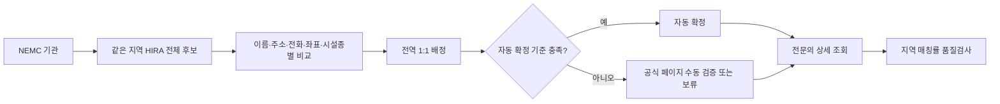
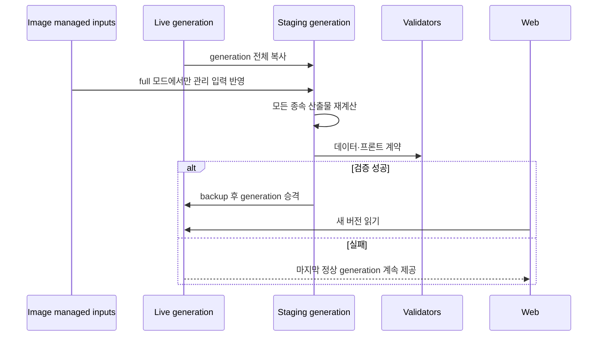

# 데이터 수집·품질·갱신 파이프라인

이 문서는 어떤 원천을 어떻게 모으고, 어디에서 결측이 생기며, 검증된 한 세대의 데이터가 프론트 화면까지 어떻게 전달되는지 설명합니다. 변동하는 운영 수치는 문서에 고정하지 않고 [운영 `/api/health`](https://emergency-dashboard-production-e303.up.railway.app/api/health)를 기준으로 확인합니다.

## 1. 분석 모집단

기준 모집단은 매 `full` 갱신에서 수집한 **NEMC 응급의료기관과 그 기관이 속한 지역**입니다.

- 병상, 접근성, 인구 대비 병상과 웹의 병원 목록은 NEMC 기관 집합을 유지합니다.
- HIRA는 응급의학과 전문의 정보를 붙이는 보강 원천입니다. HIRA 미매칭 기관을 NEMC 모집단에서 제거하지 않습니다.
- NEMC 기관 목록에서 신규 코드 없이 최대 3개 기관만 일시적으로 빠지면 이전 검증 행을 최대 3회·72시간까지만 승계합니다. 관측 이력은 영속 상태의 `hospital_population_audit.json`에 남기며, 신규·교체·대규모·장기 누락은 모집단 검토 전까지 승격하지 않습니다.
- 경계에는 NEMC 기관이 없는 지역이나 NEMC가 상위 시 단위로 집계하는 일반구가 있을 수 있습니다. 화면은 이를 저위험으로 오해하지 않도록 `미산출`과 상위 집계 공유를 구분합니다.
- 현재 기관·지역·산출 건수는 `/api/health`와 `data/hospital_master.csv`, `data/region_risk_final.csv`에서 확인합니다.

## 2. 원천별 수집 방법

| 원천 | 수집 내용 | 인증·주기 | 정규화·결합 | 주요 결과 |
|---|---|---|---|---|
| NEMC 기관정보 | 응급의료기관 코드, 이름, 등급, 주소, 좌표 | `DATA_GO_KR_API_KEY`, `full` | `hpid`를 기관 기준키로 사용하고 최신 경계·검증 보정표로 지역 확정 | `hospital_master.csv` |
| NEMC 병상정보 | 가용 응급실 병상, 기준 병상, API 기준시각 | `DATA_GO_KR_API_KEY`, `beds` | NEMC 지역별 호출 후 `hpid` 1:1 결합, 이상값·만료 원천 제거 | `bed_status.csv`, `bed_status_history.csv` |
| 행정안전부 인구 | 최신 공표 월 주민등록 인구 | 별도 키 없음, `full` | 공표 월 자동 탐색, 행정코드와 정규화 지역명으로 NEMC 지역 결합 | `mois_population_YYYYMM.csv`, `population_source.csv` |
| HIRA 병원정보 | 요양기관 이름, 주소, 전화, 좌표, 시설종별, 암호화 요양기호 | `HIRA_API_KEY`, `full` | 지역별 전체 후보 풀을 만든 뒤 NEMC↔HIRA 전역 1:1 배정 | `hira_doctor_matches.csv`, 후보·감사 CSV |
| HIRA 상세정보 | 전문과목 코드 24 응급의학과 전문의 수 | `HIRA_API_KEY`, `full` | 확정된 암호화 요양기호에만 조회 결과 결합 | `doctor_source.csv`, `doctor_score.csv` |
| 카카오모빌리티 | 자동차 최단 도로거리와 예상시간 | `KAKAO_REST_API_KEY`, `full` | 경계 내부 대표점→권역·지역응급의료센터 경로, 요청키 기반 캐시 | `kakao_route_accessibility.csv`, `kakao_hospital_routes.csv` |
| `admdongkor` | 웹 시각화용 시군구 경계 | npm 패키지, `full` | 행정코드·지역 별칭·상위 시 매핑, 경계 계약 검증 | `koreaGeo.json`, `region_route_origins.csv` |

행정안전부 원천을 구할 수 없는 경우에만 저장된 KOSIS 연간 인구 CSV를 대체 입력으로 사용할 수 있습니다. 어떤 원천과 기준월이 사용됐는지는 산출 CSV와 manifest에 보존합니다.

### NEMC 병상

병상 포화율은 다음과 같이 계산합니다.

```text
포화율 = (기준 응급실 병상 - 가용 응급실 병상) / 기준 응급실 병상 × 100
```

다음 행은 유효 병상 관측으로 사용하지 않습니다.

- API 무응답 또는 기관코드 불일치
- 기준 병상 누락·0
- 가용 병상 음수
- 원천값과 계산 포화율 불일치
- 병원이 제공한 `API기준시각`이 `BED_SOURCE_MAX_AGE_HOURS`를 초과
- 허용 범위를 넘는 미래 시각

`수집시각`은 우리 배치가 응답을 받은 시각이고, `API기준시각`은 병원이 보고한 관측 기준시각입니다. 신선도 판정에는 더 의미 있는 `API기준시각`을 사용합니다.

지역 몇 곳의 5xx·timeout 때문에 전국의 성공 응답을 폐기하지 않습니다. 신규 응답 기관 수 안전 기준을 통과하면 성공 지역은 새 값으로 승격하고, 실패 지역만 직전 행 가운데 현재도 유효하고 병상값이 정상인 행을 원래 `수집시각` 그대로 사용합니다. 유효하지 않은 fallback은 해당 지역에서만 결측 처리하며, 실패 지역·원인·fallback 수는 `bed_refresh_audit.json`과 `/api/health`의 `pipeline`에 남깁니다. 응답이 직전의 90% 또는 373곳 아래로 급감한 경우에는 fallback으로 검증을 우회하지 않고 전체 갱신을 중단합니다.

### HIRA 기관 1:1 매칭

NEMC `hpid`와 HIRA 암호화 요양기호는 서로 다른 식별자입니다. 병원명 검색 결과 하나를 바로 채택하지 않고 다음 순서로 처리합니다.



- 동일 HIRA 요양기호를 두 NEMC 기관이 사용하지 못합니다.
- 수동 확정은 `hira_match_overrides.csv`에 NEMC 코드, HIRA 요양기호, 근거 URL, 확인일과 판단 메모를 남깁니다.
- 공식 원천에 대응 기관이 없거나 폐업·이전·분리 여부가 불명확하면 억지로 0명을 넣지 않고 보류합니다.
- 지역별 자동+수동 매칭률이 80% 미만이면 그 지역의 전문의 합계와 의료진 점수를 결측 처리합니다.
- 수동 확정·제외 파일과 `hira_doctor_matches.csv`의 수동 집합이 다르면 데이터 계약이 승격을 차단합니다.

재검토할 때는 `hira_match_candidates.csv`, `hira_low_similarity.csv`, `hira_no_search_results.csv`를 먼저 보고 HIRA 공식 기관 페이지에서 기관명·주소·전화·요양기호를 확인합니다. 판단 결과는 생성 결과 CSV가 아니라 override/exclusion 입력에 기록해야 다음 전체 실행에서도 재현됩니다.

### 행정경계와 카카오 접근성

기본 출발점은 최신 시군구 경계의 기하 대표점입니다. 무게중심이 바다나 경계 밖에 있으면 가장 큰 육지 다각형의 내부점을 사용하고, 카카오가 도로를 찾지 못하면 같은 경계 안에서 탐색한 보정점을 감사값과 함께 저장합니다.

각 지역에서 직선거리 상위 후보를 먼저 호출하되, 아직 호출하지 않은 후보가 현재 최적 도로거리를 이길 수 없을 때까지 후보를 확장합니다. 최종 접근성 점수에는 카카오 `DISTANCE` 자동차 거리만 사용하고 직선거리는 후보 선별·감사용으로만 남깁니다.

병원 팝업의 거리와 시간은 사용자 현재 위치가 아니라 배치에서 계산한 지역 대표점 기준입니다. 현재 위치 기반 길찾기가 필요하면 REST 키를 브라우저에 노출하지 않는 별도 서버 endpoint와 호출량 정책이 필요합니다.

`admdongkor` 경계는 SGIS 원천을 가공한 웹 시각화용 단순화 자료이며 법적·측량·주소 판정용 공식 원본이 아닙니다. 경계 데이터의 CC BY 4.0·공공누리 제1유형과 `admdongkor` 생성 코드의 MIT 조건은 서로 구분하며, 버전·출처·이용조건은 `src/data/KOREA_GEO_LICENSE.md`에 보존합니다.

## 3. 산출 계보

```mermaid
flowchart TB
    HM[hospital_master.csv]
    BS[bed_status.csv]
    POP[population_source.csv]
    DOC[doctor_source.csv]
    ROUTE[kakao_route_accessibility.csv]

    HM --> BS
    HM --> DOC
    HM --> ROUTE
    HM & BS & POP & DOC & ROUTE --> COMPONENTS[component score CSV]
    COMPONENTS --> RISK[region_risk_final.csv]
    RISK --> MISSING[missingness_followup.csv/json]
    RISK --> ANALYSIS[correlation·VIF·regression·cluster]
    RISK & MISSING & ANALYSIS --> CONTRACT[Python + frontend contract]
    CONTRACT --> SNAPSHOT[/api/dashboard snapshot]
    SNAPSHOT --> MAP[메인 지도·상세]
    SNAPSHOT --> ANALYTICS[분석 대시보드]
```

최종 점수는 다음 네 구성점수가 모두 있을 때만 계산합니다.

```text
regionRisk =
    0.35 × 병상포화도점수
  + 0.30 × 접근성점수
  + 0.20 × 인구대비병상점수
  + 0.15 × 의료진부족점수
```

카카오 거리, 인구 대비 병상과 의료진 부족 입력은 극단값 영향을 줄이기 위해 P5~P95 범위의 Min-Max 점수로 변환합니다. 공식 상세정보에서 전문의 0명이 확인된 지역은 의료진 부족 100점이며, HIRA 미매칭으로 알 수 없는 경우와 구분합니다.

## 4. 결측을 다시 모으는 순서

결측은 `data/missingness_followup.csv`의 `원인코드`, `우선순위`, `다음조치`를 기준으로 처리합니다. 현재 건수는 파일과 `/api/health`를 조회하며 문서의 예전 숫자를 사용하지 않습니다.

| 결측 유형 | 먼저 확인할 것 | 복구 방법 | 재실행 모드 |
|---|---|---|---|
| API 무응답·429 | 공공데이터포털 키 상태, 일일 할당량, `Retry-After`, Railway 로그 | 할당량 회복 후 한 번만 재시도; 반복 호출 금지 | `beds` 또는 `full` |
| 병상 원천시각 만료 | 기관별 `API기준시각`, `수집시각` | 새 병상 응답 수집. 과거 값을 새 시각으로 바꾸지 않음 | `beds` |
| 기준 병상 누락·음수 가용 병상 | NEMC 원응답과 기관코드 | 다음 정상 원응답 대기, 원천 오류는 결측 유지 | `beds` |
| HIRA 미매칭·후보 충돌 | 후보 CSV, 공식 기관 페이지, 이름·주소·전화·좌표 | 근거 있는 override 또는 exclusion 추가 | `full` |
| 인구 지역 불일치 | 최신 공표 월, 행정코드, 개편 지역명 | 행정코드·별칭 보정 후 재수집 | `full` |
| 경계 불일치 | NEMC 주소·좌표, 최신 경계 코드 | 검증 근거가 있는 지역 보정 또는 경계 갱신 | `full` |
| 카카오 경로 실패 | 출발점 경계 포함 여부, API 오류, 호출량 | 경계 내부 보정점 탐색 후 실패 후보 재수집 | `full` |

원천 CSV의 결측을 임의로 채우지 않습니다. 수동 판단이 필요한 값만 근거·확인일이 있는 관리 입력으로 보존하고, 모든 파생 파일은 파이프라인에서 다시 만듭니다.

## 5. 신선도와 화면 표시

`GET /api/dashboard`는 두 관점을 함께 제공합니다.

- **현재 운영값**: 병상 원천 유효기간과 결측 정책을 현재 시각에 다시 적용합니다. 만료된 지역의 위험도와 병상 의존 값은 지도·상세에서 숨깁니다.
- **최근 계산값 (`analysisSnapshot`)**: 마지막 점수 계산시각의 위험도·통계 결과입니다. 분석 탭에서 계산시각, 현재 만료 지역 수와 계산 당시 원천정책 충족 여부를 함께 표시하는 참고값입니다.

따라서 “점수가 계산됐음”과 “지금도 최신 운영값임”은 같은 뜻이 아닙니다. 운영 확인에는 다음 health 필드를 함께 봅니다.

| 필드 | 의미 |
|---|---|
| `status` | `ok`, `degraded`, `unavailable` |
| `dataAsOf`, `dataAgeMinutes` | 대시보드 원천 기준시각과 경과시간 |
| `regions`, `completeRegions` | 현재 모집단과 현재 표시 가능한 지역 |
| `scoredRegions`, `scoreAsOf` | 마지막 계산에서 점수가 존재한 지역과 계산 기준시각 |
| `scoreSourcePolicyValidRegions` | 계산 당시 원천 신선도 정책을 충족한 점수 수 |
| `expiredScoreRegions` | 계산됐지만 현재 병상 유효기간이 지난 지역 |
| `bedRiskExpiredHospitals`, `nextBedRiskExpiryAt` | 병원 단위 만료와 다음 만료 예정시각 |
| `pipeline` | 최근 실행 모드·성공·실패·복구 상태, 다음 병상 시도·원천 deadline, 부분 실패 지역 감사값 |

```powershell
$appUrl = "https://emergency-dashboard-production-e303.up.railway.app"
$health = Invoke-RestMethod "$appUrl/api/health"
$health | Select-Object status, dataAsOf, regions, completeRegions, scoredRegions, expiredScoreRegions
$health.pipeline | ConvertTo-Json -Depth 8
```

## 6. `beds`와 `full` 갱신

### `beds`: 빠른 병상 갱신

1. 현재 live generation을 실행별 staging으로 복사합니다.
2. 외부 API를 호출하기 전에 기존 generation의 전체 데이터 계약을 검사합니다.
3. NEMC 병상을 수집합니다. 소수 지역만 실패하면 성공 지역과 아직 유효한 실패 지역 fallback을 결합하고 감사 JSON을 남깁니다.
4. 구성점수·최종 위험도·결측·통계분석을 다시 계산합니다.
5. Python 데이터 계약과 Node 프론트 계약을 검사합니다.
6. 모두 통과한 staging만 live와 교체합니다.

사전 계약 검증은 HIRA 관리 입력과 종속 산출물이 서로 다른 세대인 상태에서 비싼 NEMC 호출을 시작하지 않게 합니다.

### `full`: 전체 원천 갱신

1. 현재 live generation을 staging으로 복사합니다.
2. 이미지/저장소가 관리하는 다음 입력을 **staging에만** 복사합니다.
   - `hira_match_overrides.csv`
   - `hira_match_exclusions.csv`
   - `hospital_coordinate_overrides.csv`
   - `hospital_region_overrides.csv`
3. NEMC 기관, 인구, HIRA, 경계, 카카오와 모든 파생 산출물을 다시 만듭니다.
4. 최근 병상 스냅샷을 재사용하도록 설정했다면 모집단 일치·수집시각·원천시각·유효기관 하한을 시작, 점수 계산 전, 승격 직전에 검사합니다. 실패 시 병상 API로 몰래 대체하지 않고 전체 실행을 중단합니다.
5. 결측 리포트, 분석 결과, Python·프론트 계약을 검사합니다.
6. 관리 입력과 모든 종속 출력, 경계를 한 generation으로 승격합니다.

## 7. 영속 Volume과 원자성

Railway의 `/app/runtime`에는 live 데이터, 경계와 파이프라인 상태가 함께 있습니다.

```text
/app/runtime
├─ data/                 # 마지막 검증 완료 generation
├─ koreaGeo.json         # data와 함께 검증된 지도 경계
└─ state/                # 잠금·상태·staging·복구 backup
```

빈 Volume만 이미지의 검증 seed로 초기화합니다. 기존 Volume이 있으면 새 이미지 시작 시 live 파일을 직접 덮어쓰지 않습니다. 특히 HIRA override 하나만 live에 복사하고 이전 매칭 결과를 그대로 두면 서로 다른 세대가 섞이므로 금지합니다.



승격 중 종료되면 commit marker와 backup을 이용해 다음 시작에서 마지막 정상 generation을 복구합니다. 단일 Volume writer를 전제로 하므로 운영 replica는 하나여야 합니다.

## 8. 로컬 재수집

`.env.example`을 `.env`로 복사하고 서버 전용 키를 채웁니다.

```env
DATA_GO_KR_API_KEY=<공공데이터포털 NEMC 키>
HIRA_API_KEY=<공공데이터포털 HIRA 키>
KAKAO_REST_API_KEY=<카카오모빌리티 REST 키>
```

키는 Git에 커밋하지 않고 `NEXT_PUBLIC_` 접두사를 붙이지 않습니다.

```powershell
python -m venv .venv
.\.venv\Scripts\python.exe -m pip install -r requirements.txt
npm ci
.\run_pipeline.bat
```

수집 후 검증만 다시 실행할 수 있습니다.

```powershell
.\.venv\Scripts\python.exe scripts\build_missingness_report.py
.\.venv\Scripts\python.exe scripts\validate_data_contract.py
npm run validate:frontend-data
```

운영에서 수동 실행할 때는 [DEPLOYMENT.md](./DEPLOYMENT.md)의 인증된 `POST /api/ops/refresh` 절차를 사용합니다. 202 응답은 완료가 아니라 접수이므로 `/api/health`의 `pipeline`에서 최종 성공과 `dataVersion` 변경을 확인합니다.

## 9. 데이터 계약

승격 전 검증에는 다음 항목이 포함됩니다.

- NEMC 기관코드의 비어 있음·중복·모집단 급감
- 병상 기관코드 1:1, 포화율 계산식, 신선도와 이상값
- HIRA 자동·수동 1:1 식별자, 관리 입력과 결과 집합 일치
- 인구·구성점수·위험도 지역 키와 결측 일관성
- 결측 리포트가 현재 원천에서 다시 계산한 결과와 일치
- 최신 경계 코드, NEMC 지역 연결, 기관 없는 경계와 상위 집계 규칙
- 카카오 후보 prefix·최단 경로 증명·불확정 오류 부재
- 위험등급 구간과 프론트 스냅샷 필수 필드

검증 실패는 일부 파일만 운영에 반영하는 이유가 아니라 generation 전체를 폐기하는 이유입니다. 원인은 staging과 로그에서 고치고, live는 마지막 정상본으로 유지합니다.
