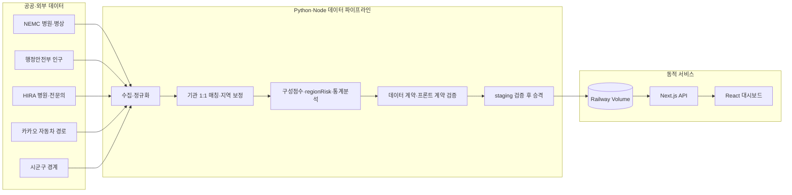

# Emergency Medical Capacity Dashboard

[](https://github.com/Westyoon/embulance_score/actions/workflows/deploy-pages.yml)

전국 응급의료기관의 병상·접근성·인구·응급의학과 전문의 데이터를 하나의 동적 파이프라인으로 결합해, 시군구별 응급의료 취약도를 지도와 분석 화면으로 제공하는 프로젝트입니다.

[라이브 대시보드](https://emergency-dashboard-production-e303.up.railway.app) · [아키텍처](./ARCHITECTURE.md) · [운영·배포 가이드](./DEPLOYMENT.md)

## 프로젝트 한눈에 보기

| 영역 | 구현 내용 |
|---|---|
| 프론트엔드 | Next.js 16·React 19 기반 전국 지도, 지역·병원 상세, 구성요인 기여도, 상관관계·군집 분석 |
| 데이터 분석 | 병상포화도·도로 접근성·인구 대비 병상·의료진 부족을 결합한 `regionRisk`, 회귀·VIF·K-Means |
| 백엔드 | NEMC·행정안전부·HIRA·카카오 API 수집, 병원 1:1 매칭, 데이터 계약 검증, ETag 기반 JSON API |
| 동적 운영 | Node 서버와 Python 스케줄러를 한 컨테이너로 운영하고, staging 검증·복구 가능한 승격·영속 Volume 적용 |
| 배포 | GitHub Actions에서 앱·파이프라인·컨테이너를 검증한 뒤 GHCR 이미지를 발행하고 Railway에 배포 |

현재 검증 산출물은 NEMC 534개 기관과 219개 지역을 유지합니다. HIRA는 532개 기관을 연결했고, 카카오 자동차 경로는 219개 지역과 534개 병원에 연결했습니다. 네 구성점수가 모두 확보된 196개 지역만 최종 위험도를 표시하며, 나머지는 점수를 임의 보간하지 않고 `원천데이터부족`으로 공개합니다.



설계의 핵심은 화면과 분석 산출물을 따로 관리하지 않는 것입니다. 브라우저는 서버가 같은 검증 CSV와 경계에서 만든 스냅샷을 읽고, 배치 실패 시에는 마지막 정상 버전을 계속 제공합니다. 상세한 컴포넌트 경계, 갱신 시퀀스와 장애 처리 방식은 [ARCHITECTURE.md](./ARCHITECTURE.md)에 정리했습니다.

## 빠른 재현

필수 환경은 Python 3.12 이상과 Node.js 20.12 이상이며, 운영 이미지와 같은 Node.js 22를 권장합니다. 외부 API를 다시 수집하지 않고 저장소의 검증 완료 스냅샷으로 웹만 실행할 수 있습니다.

```powershell
python -m venv .venv
.\.venv\Scripts\python.exe -m pip install -r requirements.txt
npm ci
npm run validate:frontend-data
npm run dev
```

전체 원천을 재수집하려면 `.env.example`을 `.env`로 복사한 뒤 `DATA_GO_KR_API_KEY`, `HIRA_API_KEY`, `KAKAO_REST_API_KEY`를 설정하고 실행합니다. 실제 `.env`는 Git에서 제외됩니다.

```powershell
.\run_pipeline.bat
npm run lint
npm run test:dashboard
.\.venv\Scripts\python.exe -m unittest discover -s tests -v
npm run build
```

> 전체 수집은 공공 API와 카카오 API 호출량을 사용합니다. NEMC 병상은 전국 219개 지역 단위 호출이 필요하므로, 키 할당량을 확인하지 않은 상태에서는 저장된 스냅샷으로 UI와 검증 절차부터 재현하는 것을 권장합니다.

## 현재 진행 상황

현재 저장된 산출물 기준입니다. 병상 데이터는 2026-08-31 20:18 KST 수집 스냅샷이며, 인구와 행정경계는 각각 2026년 7월 자료로 갱신되어 있습니다.

| 단계 | 상태 | 현재 결과 |
|---|---|---|
| PART 1 병원 마스터 | 완료 | NEMC 응급의료기관 534개, 219개 지역, 좌표 결측 0개 |
| PART 2 실시간 병상 | 완료 | NEMC 534개 유지, API 응답 442개·원천시각 12시간 이내 유효 포화율 400개 |
| PART 3 접근성 | 완료 | 카카오 자동차 최단거리 경로 219개 지역·534개 병원 |
| PART 3 인구 대비 병상 | 완료 | 행정안전부 2026년 7월 인구 기준, 219개 지역 전부 매칭 |
| PART 3 의료진 부족 | 부분 완료 | HIRA 532개 매칭(자동 523개·수동검증 9개), 219개 지역 전부 사용 가능 |
| PART 3 최종 regionRisk | 부분 완료 | 219개 중 196개 산출 완료, 23개 원천데이터부족 |
| PART 4 상관관계·VIF | 완료 | 최종 점수가 완성된 지역 대상 |
| PART 4 선형회귀 | 완료 | 완료지역 196개 전체, R² 0.861, MAE 3.07 |
| PART 4 K-Means | 완료 | 196개 지역, 최적 k=2 |
| 최신 시군구 경계 | 완료 | `admdongkor` `20260701`, 256개 경계 |
| PART 4 과거 시간대 분석 | 미완료 | 2024년 병상 이력 원자료 필요 |

최종 위험도가 없는 23개 지역은 임의 점수로 대체하지 않고 `원천데이터부족`으로 표시합니다. 기존 누락·이상값과 함께, 병원 자체 `API기준시각`이 수집시각보다 12시간 넘게 오래된 병상 행을 최신값으로 오인하지 않도록 제외한 결과입니다.

### 결측 후속조치

`beds`와 `full` 갱신은 점수 계산 직후 `scripts/build_missingness_report.py`를 실행합니다. 현재 원천과 리포트가 다르면 데이터 계약 검증이 승격을 중단하므로, 결측 목록이 운영 데이터와 따로 오래되지 않습니다.

- 지역 위험도 결측: 23개 지역
- 병원 병상 결측: 134개 (`API 무응답 92`, `원천시각 12시간 초과 27`, `총병상 누락 1`, `음수 가용병상 14`)
- HIRA 수동 확인 대기: 2개 병원(두 지역 모두 현재 80% 품질 기준 통과)
- 추적 목록: `data/missingness_followup.csv`
- 요약·품질정책: `data/missingness_followup_summary.json`

각 행에는 우선순위, 원인코드, 확인시각, 상태와 다음 조치가 들어 있습니다. 원천 CSV를 수정하지 않고 리포트만 다시 만들려면 다음 명령을 사용합니다.

```powershell
.\.venv\Scripts\python.exe scripts\build_missingness_report.py
```

## 데이터 출처

- 국립중앙의료원 전국 응급의료기관 정보 조회 서비스
  - 병원 기본정보
  - 현재 시점 실시간 가용 응급실 병상
- 행정안전부 주민등록 인구통계
  - 최신 공표 월을 자동 확인해 월간 CSV를 수집
  - 현재 계산에는 2026년 7월 자료를 사용하며 NEMC 219개 지역을 모두 포함
- KOSIS `행정구역(시군구)별/1세별 주민등록인구`
  - 행정안전부 원천이 없을 때만 기존 연간 CSV를 대체 입력으로 사용
- 건강보험심사평가원 병원정보서비스
  - 병원명, 주소, 암호화 요양기호
- 건강보험심사평가원 의료기관별 상세정보서비스
  - 전문과목 코드 24, 응급의학과 전문의 수
- [카카오모빌리티 자동차 길찾기 API](https://developers.kakaomobility.com/guide/navi-api/directions)
  - 최신 경계 기반 지역 대표점에서 권역·지역응급의료센터까지의 최단 도로거리와 예상시간
  - 정적 웹 병원 팝업용 지역 대표점→NEMC 534기관 사전계산 경로
- [`admdongkor`](https://github.com/vuski/admdongkor) 시군구 경계
  - 현재 지도에는 `20260701` 버전 256개 경계를 사용
  - 통계청 통계지리정보서비스(SGIS) 경계를 가공한 웹 시각화용 `light` 단순화 자료
  - 데이터 라이선스는 CC BY 4.0과 공공누리 제1유형(출처표시)이며, 생성 코드의 MIT 라이선스와 구분
  - 법적·측량·주소 판정용 공식 원본이 아니며, 상세 출처와 이용조건은 `src/data/KOREA_GEO_LICENSE.md`에 기록

## 기관 매칭 및 분석 모집단 정책

분석의 기준 모집단은 **NEMC 응급의료기관 534개와 이 기관들이 속한 219개 지역**입니다. 병상·접근성·인구 대비 병상 집계와 웹의 병원 목록은 이 모집단을 유지합니다.

HIRA는 NEMC 모집단에 응급의학과 전문의 정보를 붙이는 **LEFT JOIN 보강 원천**입니다. NEMC의 `hpid`와 HIRA의 암호화 요양기호는 서로 다른 코드이므로 병원명과 주소로 대응 관계를 확인합니다. HIRA 매칭에 실패해도 NEMC 기관을 모집단에서 제거하지 않으며, 해당 HIRA 보강값만 결측으로 유지합니다.

2026-08-31 최신 HIRA 전체목록 재검증 결과는 다음과 같습니다.

- NEMC 응급의료기관: 534개
- HIRA 전체 매칭: 532개
  - 자동매칭: 523개
  - 수동검증: 9개
- 검색 결과 없음: 0개
- 동일 건물의 재활병원 후보 2개 보류
- 지역별 80% 매칭 기준: 219개 지역 전부 통과, 최저 매칭률 87.5%

동일 HIRA 식별자로 잘못 연결됐던 명지병원 2건과 기존 지역 불일치·식별자 충돌 6건은 공식 HIRA 기관 페이지를 근거로 분리 검증했습니다. 강남힐병원(`A1100076`)은 같은 날 HIRA 최신 전체목록에 새 암호화 요양기호로 다시 나타나 병원명·주소가 완전히 일치하고 전화·좌표도 동일 기관임을 재확인했습니다. 공식 상세 페이지와 전문의 API가 모두 응급의학과 전문의 0명을 반환하므로 이를 수동 근거에 기록했으며, 관악구도 4개 중 4개가 연결되어 지역 기준을 통과합니다.

- `A2100042` 고양 명지병원: 응급의학과 전문의 12명
- `A2300009` 제천 명지병원: 응급의학과 전문의 7명

현재 보류된 2개 병원과 향후 새 미매칭 기관은 다음 절차로 처리합니다.

1. 병원명, 주소, 전화번호와 지역을 이용해 수동 검토합니다.
2. 동일 기관임을 확인할 수 있는 경우 NEMC `hpid`와 HIRA 암호화 요양기호의 매핑 테이블에 등록합니다.
3. 폐업·이전·명칭 변경·기관 분리 여부를 확인할 수 없거나 HIRA에 대응 기관이 없는 경우 HIRA 의료인력 보강값을 결측으로 유지합니다.
4. 병상·접근성·인구 집계에서는 해당 기관을 포함한 NEMC 모집단을 그대로 사용합니다.
5. 지역 HIRA 매칭률(자동매칭+수동검증)이 80% 미만이면 전문의 수를 신뢰하지 않고 `의료진부족점수`를 결측 처리합니다. 네 구성점수가 모두 있을 때만 `regionRisk`를 산출합니다.

이 정책은 억지 매칭이나 전문의 수 0명 오판을 막으면서 NEMC 기준 모집단을 보존합니다. HIRA 미매칭은 기관 제외나 전문의 0명을 뜻하지 않습니다. 다만 의료진 점수가 결측인 지역은 최종 위험도 완료 집합에서 빠지므로, 모든 결과에 NEMC 기관 수와 지역별 HIRA 매칭률·산출상태를 함께 기록합니다.

2026-08-30 NEMC 최신 조회에서는 부산 연제구 비에스길종합병원(`A1207152`)이 추가되고 경기도 오산시 조은오산병원(`A2114449`)이 제외됐습니다. 전체 534기관·219지역은 유지했으며, 병상·HIRA·카카오 병원 경로를 새 기관 집합으로 다시 생성했습니다.

검토·감사 파일:

- `data/hira_no_search_results.csv`: HIRA 검색 결과가 없는 병원 0개
- `data/hira_low_similarity.csv`: 동일 건물의 유사 기관 2개와 HIRA 원천 불일치 1개
- `data/hira_match_overrides.csv`: 근거 URL과 확인일을 포함한 수동검증 9개
- `data/hira_match_exclusions.csv`: HIRA 원천 미제공 기관의 이전 요양기호·공식 근거·확인일(30일 재검증)
- `data/hira_doctor_matches.csv`: 전체 자동·수동 매칭 결과와 품질 정보
- `data/hira_match_candidates.csv`: 기관별 상위 후보와 이름·주소·전화·좌표·시설종별 판단 근거
- `data/hira_catalog_manifest.json`: HIRA 전체목록 수집시각·건수·매칭 로직 버전·수동 매칭·원천 미제공 이력

수동 매핑 결과는 재실행 가능한 `data/hira_match_overrides.csv`로 관리하고, 원본 API 응답이나 자동매칭 결과를 직접 덮어쓰지 않는 것을 원칙으로 합니다.

## 구현 포인트와 코드 탐색

| 역할 | 핵심 구현 | 코드 위치 |
|---|---|---|
| 프론트엔드 | 전국 지도, 지역·병원 상세, 기여도·상관관계·군집 화면 | `src/components/`, `src/lib/riskScale.js` |
| 서버 API | 버전이 있는 대시보드 스냅샷, health, 인증된 수동 갱신 | `src/app/api/`, `src/lib/dashboardSnapshot.js` |
| 데이터 엔지니어링 | 외부 원천 수집, 정규화, HIRA 1:1 배정, 카카오 경로 캐시 | `scripts/part1_*` ~ `scripts/part3_*` |
| 데이터 분석 | 네 구성점수, 최종 위험도, 상관관계·VIF·회귀·K-Means | `scripts/part3_calculate_region_risk.py`, `scripts/part4_analyze.py` |
| 운영 백엔드 | 스케줄링, 실행 잠금, staging 검증, 승격·rollback | `scripts/start_dynamic.mjs`, `scripts/run_pipeline.py`, `scripts/run_bed_refresh.py` |
| 품질·배포 | Python·Node 계약 테스트, Docker smoke test, GHCR 발행 | `tests/`, `.github/workflows/deploy-pages.yml`, `Dockerfile` |

```text
.
├─ src/app                   # Next.js 페이지·서버 API
├─ src/components            # 지도·상세·분석 화면
├─ src/lib                   # 서버 데이터 로더·등급·지도 로직
├─ scripts                   # 수집·분석·검증·동적 런처
├─ data                      # 검증 완료 seed·분석 결과·매칭 감사 자료
├─ tests                     # Python·Node 회귀 테스트
├─ Dockerfile                # Python 3.12 + Node.js 22 운영 이미지
├─ ARCHITECTURE.md           # 컴포넌트·데이터·승격 구조
└─ DEPLOYMENT.md             # Railway 설정·수동 갱신·복구 절차
```

## 인증, 테스트와 동적 운영

전체 재수집에는 루트 `.env`의 `DATA_GO_KR_API_KEY`, `HIRA_API_KEY`, `KAKAO_REST_API_KEY`가 필요합니다. 수동 갱신 API를 켤 때만 `PIPELINE_ADMIN_TOKEN`도 설정합니다. `.env`는 추적하지 않으며 모든 키는 서버 전용이므로 `NEXT_PUBLIC_` 접두사를 사용하지 않습니다.

GitHub Actions는 프론트 데이터 계약·Node 테스트·lint·build와 Python 단위 테스트·데이터 계약을 병렬 검증합니다. 그 다음 Docker 이미지를 만들고, 패키지 내부 계약과 실제 `/api/health`·HTML·정적 asset·Volume 관리 파일 동기화를 smoke test합니다. 모든 검증을 통과한 `backend` 브랜치 push만 GHCR의 `backend`와 commit SHA 태그로 발행됩니다.

동적 런타임은 `npm run start:dynamic`으로 Next.js 서버와 Python 스케줄러를 함께 실행합니다. 저장소의 검증 seed를 `runtime/`에 초기화한 뒤, 운영에서는 8시간 `beds` 갱신과 24시간 `full` 갱신을 수행합니다. API 할당량, 단일 replica, Volume, health check, 수동 갱신과 복구 절차는 [DEPLOYMENT.md](./DEPLOYMENT.md)를 따릅니다.

## 분석 산식

### 병상 포화율

```text
포화율 = (기준 응급실 병상 - 가용 응급실 병상) / 기준 응급실 병상 × 100
```

전체 병상이 없거나 0인 경우와 음수 가용병상은 결측으로 처리합니다.

### 지역 위험도

```text
regionRisk =
    0.35 × 병상포화도점수
  + 0.30 × 접근성점수
  + 0.20 × 인구대비병상점수
  + 0.15 × 의료진부족점수
```

네 구성점수가 모두 존재할 때만 `regionRisk`를 산출합니다. 병상 관련 점수는 해당 수집시각에 유효하게 보고한 NEMC 기관을 대상으로 하며, 지역 상세 화면에서 반영 기관 수와 전체 NEMC 기관 수를 함께 확인할 수 있습니다.

### 위험등급

백엔드 CSV와 프론트 화면은 동일한 고정 구간과 명칭을 사용합니다. 경계값은 낮은 단계에 포함됩니다.

| `regionRisk` | 위험등급 | 위험등급명 |
|---|---:|---|
| 0 이상 20 이하 | 1 | 매우낮음 |
| 20 초과 35 이하 | 2 | 낮음 |
| 35 초과 50 이하 | 3 | 보통 |
| 50 초과 65 이하 | 4 | 높음 |
| 65 초과 100 이하 | 5 | 매우높음 |

점수가 없는 지역은 등급을 부여하지 않고 `미산출`로 표시합니다.

### 점수 정규화

- 카카오 최단 도로거리, 인구 대비 병상비율, 전문의 1인당 병상 수는 P5~P95 기준 Min-Max 방식으로 0~100점화합니다.
- 응급의학과 전문의가 실제로 0명인 지역은 의료진 부족 100점으로 처리합니다.
- HIRA 병원 매칭률(자동매칭+수동검증)이 80% 미만인 지역은 전문의 수를 신뢰하지 않고 결측 처리합니다.

## 분석 결과

### 상관관계와 VIF

네 구성점수의 상관계수와 VIF를 계산합니다. 현재 VIF는 약 1.13~2.47로 심각한 다중공선성은 확인되지 않았습니다.

### 선형회귀

응급의학과 전문의가 0명인 지역은 `병상수 / 전문의수` 비율이 무한대가 되므로 이 비율을 회귀 입력으로 사용하면 완료지역이 탈락합니다. 현재 회귀는 해당 지역을 포함하기 위해 의료진 변수만 0명 지역을 100점으로 보존하는 `의료진부족점수`를 사용하고, 나머지 세 변수는 원천값을 사용합니다.

```text
X = 포화율, 도로거리_km, 인구대비병상비율, 의료진부족점수
y = regionRisk
```

현재 결과:

- 분석 지역: 196개
- R²: 0.8613975747
- MAE: 3.0653038392

`의료진부족점수`는 `regionRisk`의 직접 구성요소이므로 이 회귀는 독립적인 예측 성능이나 인과관계를 검증하지 않습니다. 현재 위험도 산식이 입력 변화에 얼마나 민감한지 확인하는 보조 분석으로만 해석해야 합니다. 실제 정책 효과를 분석하려면 이송 거절, 재이송, 장기 체류 등 외부 결과변수가 필요합니다.

### K-Means 지역 유형

k=2~8의 실루엣 점수를 비교했으며 현재 최적값은 k=2입니다.

| 클러스터 | 지역 수 | 해석 | 평균 regionRisk |
|---|---:|---|---:|
| 0 | 122 | 도시형·인구 대비 병상 부담형 | 25.09 |
| 1 | 74 | 접근성·의료진 취약형 | 42.53 |

클러스터 번호는 위험등급이나 순위를 의미하지 않습니다. 군집별 평균 특성을 확인한 뒤 붙인 설명입니다.

## 주요 결과 파일

### 원천 및 중간 데이터

- `data/hospital_master.csv`: 전국 응급의료기관 마스터
- `data/hospital_coordinate_overrides.csv`: 새강병원 1건의 검증 좌표와 근거
- `data/hospital_region_overrides.csv`: 최신 경계와 NEMC 주소 구명이 충돌한 기관의 검증 지역과 근거
- `data/bed_status.csv`: 현재 병상 상태
- `data/bed_status_history.csv`: 실행 시점별 병상 스냅샷 누적
- `data/mois_population_YYYYMM.csv`: 행정안전부 월별 주민등록 인구 원천
- `data/population_source.csv`: NEMC 지역 기준으로 정제한 인구와 행정코드
- `data/doctor_source.csv`: 시군구별 응급의학과 전문의 수와 매칭 품질
- `data/hira_doctor_matches.csv`: NEMC-HIRA 병원별 매칭 상세
- `data/region_route_origins.csv`: 최신 경계에서 계산하고 카카오 도로탐색으로 검증한 지역 대표점
- `data/kakao_route_candidates.csv`: 지역별 초기 10곳과 전역 최단 증명에 필요한 추가 센터의 직선거리 감사값·카카오 경로 결과
- `data/kakao_route_accessibility.csv`: 전체 권역·지역응급의료센터 중 지역별 최단 도로거리로 선택된 경로 219건
- `data/kakao_hospital_routes.csv`: 정적 웹 병원 팝업용 지역 대표점→NEMC 534기관 경로

### 점수 및 최종 위험도

- `data/accessibility_score.csv`
- `data/population_bed_score.csv`
- `data/doctor_score.csv`
- `data/region_risk_final.csv`
- `data/missingness_followup.csv`: 지역·병원별 결측 원인, 우선순위와 다음 조치
- `data/missingness_followup_summary.json`: 결측 유형별 현재 건수와 품질정책

### 분석 결과

- `data/heatmap_matrix.csv`: 현재 누적 이력의 요일×시간 포화율
- `data/correlation_matrix.csv`: 상관계수 행렬
- `data/vif_result.csv`: 다중공선성 진단
- `data/regression_result.csv`: 3개 원천값과 의료진부족점수의 회귀계수
- `data/regression_metrics.json`: R², MAE, 절편
- `data/cluster_k_evaluation.csv`: k별 실루엣 점수
- `data/cluster_result.csv`: 지역별 클러스터
- `data/cluster_profile.csv`: 클러스터별 평균 특성

## 데이터 한계와 남은 작업

### 2024년 병상 이력

현재 NEMC API는 과거 기간 조회가 아니라 현재 시점의 실시간 상태를 제공합니다. 따라서 현재 `bed_status_history.csv`만으로는 2024년 요일·시간·계절 패턴을 분석할 수 없습니다.

다음 중 하나가 필요합니다.

1. 국립중앙의료원 또는 공공데이터포털을 통해 2024년 병상 이력 원자료 제공신청
2. 현 시점부터 파이프라인을 정기 실행해 자체 이력 축적

### 최신 행정경계와 데이터 연결

지도는 통계청 SGIS 경계를 기반으로 `admdongkor`가 가공한 `20260701` 시군구 경계 256개를 사용합니다. 이 파일은 웹 시각화를 위한 `light` 단순화 자료로, 법적·측량·주소 판정용 공식 원본이 아닙니다. 경계 데이터에는 CC BY 4.0과 공공누리 제1유형 출처표시 조건이 적용됩니다. NEMC 분석 데이터와 경계는 완전한 1:1 관계가 아닙니다.

- 경계 206개는 NEMC 지역 데이터와 직접 연결됩니다.
- NEMC가 상위 시 단위로 집계한 13개 지역은 최신 경계의 일반구 39개에 매핑됩니다. 이 39개 일반구는 구별 독립 점수가 아니라 동일한 상위 시 집계값을 표시합니다.
- 최신 경계에는 NEMC 응급의료기관이 없는 11개 지역이 있습니다: 강원특별자치도 고성군·양양군·인제군, 경기도 과천시·의왕시·하남시, 대구광역시 군위군, 부산광역시 강서구, 전북특별자치도 완주군, 충청남도 계룡시, 충청북도 증평군.

따라서 NEMC의 219개 분석 지역은 모두 지도에 연결되지만, 위 11개 경계는 위험이 낮다는 뜻이 아니라 `NEMC 기관 없음/미산출`로 표시해야 합니다. 행정안전부 2026년 7월 인구는 NEMC 219개 지역과 모두 매칭되어 과거 KOSIS 2024 경계 불일치로 인한 인구 결측은 해소되었습니다. `scripts/validate_data_contract.py`가 이 연결 상태와 최신 인천 경계 코드를 검사합니다.

2026-08-30 확인 시 NEMC 병원정보 API는 가톨릭관동대학교국제성모병원(`A1400015`) 주소를 폐지된 `인천광역시 서구`로 다시 반환했습니다. 병원 좌표가 최신 `20260701` 경계 코드 `28275 서해구` 내부임을 확인해 `data/hospital_region_overrides.csv`에서 `서해구`로 보정합니다. 이 보정을 적용하지 않으면 실제 기관 수는 534개로 같아도 가짜 220번째 지역이 생기므로 파이프라인이 승격을 차단합니다. 보정표에는 기대하는 NEMC 원본 지역도 함께 기록하며, 이후 원천 기관명이나 지역이 바뀌면 자동 덮어쓰지 않고 재검토 오류로 중단합니다.

### HIRA 병원 매칭

NEMC의 `hpid`와 HIRA의 암호화 요양기호는 서로 다른 코드입니다. NEMC를 기준 모집단으로 유지하고 HIRA 의료인력 정보를 병원명과 주소로 LEFT JOIN합니다. 대응 관계를 확인할 수 없는 기관은 HIRA 보강값만 결측 처리하며 NEMC 모집단에서는 제거하지 않습니다. 수동 매핑은 별도 파일로 관리하여 판단 근거와 재현성을 보존합니다.

전체 HIRA 목록을 시군구별 후보 풀로 사용하고 이름·주소·전화·좌표·시설종별을 함께 비교합니다. 후보는 요양기호가 중복되지 않도록 전역 1:1로 배정하며, 공식 페이지 수동검증은 `hira_match_overrides.csv`에 근거 URL과 확인일을 보존합니다. 강남힐병원과 고양·제천 명지병원을 포함한 9개 수동검증과 523개 자동매칭으로 219개 지역이 모두 80% 기준을 통과합니다. 남은 2개 후보모호 기관은 억지로 연결하지 않지만 해당 지역의 매칭률은 기준 이상이라 지역 의료진 점수는 정상 산출됩니다.

### 병원 좌표 보완

NEMC 원천에서 좌표가 없었던 새강병원(`A2502742`) 1건은 병원 공식 주소와 OpenStreetMap 병원 건물명·도로명을 교차검증해 `data/hospital_coordinate_overrides.csv`로 보완했습니다. 현재 534개 NEMC 기관의 좌표 결측은 0개입니다.

### 접근성 중심점

기본 출발점은 `src/data/koreaGeo.json`의 최신 `20260701` 시군구 경계에서 계산한 기하 대표점입니다. 오목 경계나 도서 지역에서 무게중심이 바다·경계 밖에 놓이면 가장 큰 육지 다각형 내부점을 사용하고, 카카오가 주변 도로를 찾지 못하면 같은 경계 안의 인근 점을 탐색해 `도로탐색보정`으로 기록합니다. 병원 좌표 평균은 출발점으로 사용하지 않습니다.

이 대표점은 행정경계 기반 기하점이며 인구가중 중심이나 실제 신고 위치가 아닙니다. 향후 검증된 공식·인구가중 중심점 파일을 `data/region_centroids.csv`로 추가하면 이를 우선 사용합니다. 필요한 컬럼은 다음과 같습니다.

```csv
시도,시군구,위도,경도
```

접근성점수는 각 지역 대표점에서 직선거리로 가까운 권역·지역응급의료센터 10곳을 먼저 호출한 뒤, 현재 최적 도로거리보다 직선거리 하한이 작은 다음 후보를 자동으로 계속 평가해 전체 센터 중 카카오 `DISTANCE` 도로거리가 가장 짧은 센터를 선택합니다. 후보 순위가 전체 센터의 직선거리 정렬 prefix인지, 다음 미호출 후보가 현재 최적값을 이길 수 없는지, 최단 후보 안에 불확정 API 오류가 없는지를 승격 전에 다시 검증합니다. 후보 선별용 직선거리는 감사 열로만 보존하고 점수·회귀에는 사용하지 않습니다. 웹 데이터는 동적으로 갱신되지만 병원 팝업의 거리와 예상시간은 사용자 현재 위치가 아니라 배치에서 계산한 해당 지역 대표점 기준입니다. 사용자 현재 위치 기준 실시간 길찾기는 REST 키를 브라우저에 노출하지 않는 별도 서버 API가 필요합니다.
