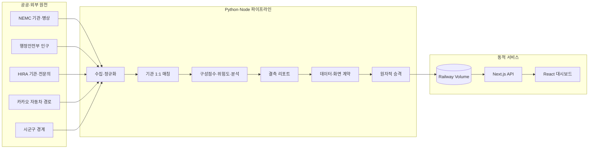

# Emergency Medical Capacity Dashboard

[](https://github.com/Westyoon/embulance_score/actions/workflows/ci-production.yml)

전국 응급의료기관의 병상·접근성·인구·응급의학과 전문의 데이터를 하나의 동적 파이프라인으로 결합해, 시군구별 응급의료 취약도를 지도와 분석 화면으로 제공하는 프로젝트입니다.

[라이브 대시보드](https://emergency-dashboard-production-e303.up.railway.app) · [운영 상태 API](https://emergency-dashboard-production-e303.up.railway.app/api/health) · [데이터 파이프라인](./DATA_PIPELINE.md) · [시스템 아키텍처](./ARCHITECTURE.md) · [배포 가이드](./DEPLOYMENT.md)

담당 범위는 백엔드 API, 데이터 수집·검증 파이프라인, 프론트엔드 데이터 계약 통합, 동적 배포와 운영 자동화입니다.

> 기관 수, 산출 지역 수, 결측 수와 수집시각은 배치마다 달라집니다. README의 숫자를 운영 현황으로 간주하지 않고, 항상 [`GET /api/health`](https://emergency-dashboard-production-e303.up.railway.app/api/health)의 `dataAsOf`, `scoredRegions`, `completeRegions`, `expiredScoreRegions`, `pipeline`을 확인합니다.

## 해결한 문제

응급의료 취약도를 계산하려면 서로 다른 식별자·갱신주기·품질 규칙을 가진 원천을 함께 다뤄야 합니다. 이 프로젝트는 다음 문제를 하나의 제품 흐름으로 해결합니다.

- NEMC를 분석 모집단으로 고정하고 HIRA 의료인력을 LEFT JOIN해 미매칭 기관이 모집단에서 사라지지 않게 했습니다.
- HIRA 후보를 이름뿐 아니라 주소·전화·좌표·시설종별로 비교하고, 동일 식별자 중복을 막는 전역 1:1 배정을 적용했습니다.
- 오래된 병상, API 무응답, 이상값과 낮은 HIRA 매칭률을 0으로 대체하지 않고 결측 사유로 추적합니다.
- 수집·분석·프론트 데이터 계약을 모두 통과한 staging만 영속 Volume에 승격합니다.
- 현재 병상 원천이 만료되면 메인 지도 점수는 숨기되, 분석 화면에서는 계산시각과 만료 여부를 붙인 최근 계산값을 참고용으로 제공합니다.

## 포트폴리오 핵심 구현

| 영역 | 구현 내용 | 코드 |
|---|---|---|
| 프론트엔드 | Next.js 16·React 19 지도, 지역·병원 상세, 기여도·상관관계·군집 화면 | `src/app/`, `src/components/` |
| 서버 API | ETag 기반 대시보드 스냅샷, 신선도 health, Bearer 인증 갱신 API | `src/app/api/`, `src/lib/dashboardSnapshot.js` |
| 데이터 엔지니어링 | NEMC·행정안전부·HIRA·카카오 수집, 기관 1:1 매칭, 경계·지역 보정 | `scripts/part1_*` ~ `scripts/part3_*` |
| 데이터 분석 | 구성점수, `regionRisk`, 결측 리포트, 상관관계·VIF·회귀·K-Means | `scripts/part3_calculate_region_risk.py`, `scripts/part4_analyze.py` |
| 운영 백엔드 | 스케줄링, 단일 실행 잠금, staging 검증, 원자적 승격·복구 | `scripts/start_dynamic.mjs`, `scripts/run_pipeline.py`, `scripts/run_bed_refresh.py` |
| 품질·배포 | Python·Node 회귀 테스트, 데이터 계약, Docker smoke test, GHCR·Railway | `tests/`, `.github/workflows/ci-production.yml`, `Dockerfile` |

## 전체 구조



브라우저는 CSV나 API 키에 직접 접근하지 않습니다. Next.js 서버가 같은 검증 산출물과 경계를 읽어 `/api/dashboard` JSON을 만들고, 화면은 데이터 버전과 ETag가 바뀔 때 갱신합니다. 배치가 실패하면 live 파일을 건드리지 않고 마지막 검증 버전을 계속 제공합니다.

자세한 수집원·식별자·결측 정책과 원자적 갱신 절차는 [DATA_PIPELINE.md](./DATA_PIPELINE.md), 컴포넌트 경계와 런타임 구조는 [ARCHITECTURE.md](./ARCHITECTURE.md)에서 확인할 수 있습니다.

## 데이터 출처와 결합 기준

| 원천 | 사용 데이터 | 결합 기준 |
|---|---|---|
| NEMC 공공데이터 API | 응급의료기관 마스터, 실시간 가용·기준 병상 | `hpid`와 NEMC 시군구를 기준 모집단으로 사용 |
| 행정안전부 주민등록 인구통계 | 최신 공표 월 시군구 인구 | 행정코드·정규화 지역명 |
| HIRA 병원정보·기관별 상세정보 | 요양기관 기본정보, 응급의학과 전문의 | 이름·주소·전화·좌표·시설종별 전역 1:1 매칭 |
| 카카오모빌리티 길찾기 | 지역 대표점→응급의료센터 자동차 거리·시간 | 경계 내부 대표점과 병원 좌표 |
| `admdongkor` 경계 | 웹 시각화용 시군구 GeoJSON | 행정코드·지역 별칭·상위 시 매핑 |

전체 재수집에 필요한 서버 전용 키는 `DATA_GO_KR_API_KEY`, `HIRA_API_KEY`, `KAKAO_REST_API_KEY`입니다. 수동 갱신 API를 사용할 때만 `PIPELINE_ADMIN_TOKEN`이 추가로 필요합니다. 실제 `.env`는 Git에서 제외하며 어떤 키에도 `NEXT_PUBLIC_` 접두사를 붙이지 않습니다.

## 점수와 결측 정책

```text
regionRisk =
    0.35 × 병상포화도점수
  + 0.30 × 접근성점수
  + 0.20 × 인구대비병상점수
  + 0.15 × 의료진부족점수
```

네 구성점수가 모두 있을 때만 최종 점수를 계산합니다.

- 전체병상 누락·0, 음수 가용병상, API 무응답과 원천시각 만료는 병상 결측으로 처리합니다.
- HIRA 지역 매칭률이 80% 미만이면 전문의 합계를 신뢰하지 않고 의료진 점수를 결측 처리합니다.
- HIRA 미매칭은 전문의 0명을 뜻하지 않습니다. 확인된 0명과 매칭 실패를 구분합니다.
- 원천 결측 지역에는 점수와 등급을 만들지 않고 `원천데이터부족`으로 표시합니다.
- 병상 유효기간이 지난 점수는 메인 지도에서 숨기고, 분석 화면의 최근 계산값에는 계산시각·만료·당시 원천정책 상태를 명시합니다.

백엔드와 프론트는 같은 위험등급 구간을 사용합니다.

| `regionRisk` | 등급 |
|---|---|
| 0 이상 20 이하 | 매우낮음 |
| 20 초과 35 이하 | 낮음 |
| 35 초과 50 이하 | 보통 |
| 50 초과 65 이하 | 높음 |
| 65 초과 100 이하 | 매우높음 |

결측 후속조치 파일은 매 갱신에서 원천과 함께 다시 생성됩니다.

- `data/missingness_followup.csv`: 지역·병원별 원인코드, 우선순위, 상태와 다음 조치
- `data/missingness_followup_summary.json`: 원인별 집계와 품질정책
- `data/hira_match_candidates.csv`: HIRA 후보별 비교 근거
- `data/hira_match_overrides.csv`: 공식 URL과 확인일을 포함한 수동 확정
- `data/hira_match_exclusions.csv`: 공식 근거가 있는 제외와 재검토 시점
- [`MISSING_DATA_HANDOFF.md`](./MISSING_DATA_HANDOFF.md): 원천 결측을 담당자별 티켓으로 넘기기 위한 대상 목록, 증빙과 완료 조건

## 빠른 재현

Python 3.12 이상과 Node.js 20.12 이상이 필요하며, 운영 이미지와 같은 Node.js 22를 권장합니다. 외부 API를 호출하지 않고 저장소의 검증 seed로 화면과 데이터 계약을 먼저 재현할 수 있습니다.

```powershell
python -m venv .venv
.\.venv\Scripts\python.exe -m pip install -r requirements.txt
npm ci
npm run validate:frontend-data
npm run dev
```

전체 원천을 다시 수집하려면 `.env.example`을 `.env`로 복사해 세 API 키를 채운 뒤 실행합니다.

```powershell
.\run_pipeline.bat
```

> 전체 수집은 실제 API 호출량을 사용합니다. 특히 NEMC 병상은 분석 지역별 호출이 필요하므로 공공데이터포털 일일 할당량을 확인한 뒤 실행합니다.

## 검증

```powershell
npm run validate:frontend-data
npm run test:dashboard
npm run test:scheduler
npm run lint
npm run build
.\.venv\Scripts\python.exe -m unittest discover -s tests -v
.\.venv\Scripts\python.exe scripts\validate_data_contract.py
```

테스트는 모집단·HIRA 1:1 매칭·결측 리포트·경계 연결·위험등급·신선도 마스킹·최근 계산값 표시·지도 hover와 병상 우선 스케줄 정책을 포함합니다. CI는 같은 검증을 수행한 뒤 Docker 이미지를 만들고 실제 `/api/health`, HTML, 정적 asset과 Volume 동작을 smoke test합니다.

## Git 운영 기준

- `main`이 코드·문서·배포 이미지의 단일 기준 브랜치입니다.
- 기능 작업은 별도 브랜치에서 진행하고 `main` 대상 Pull Request로 검증합니다.
- `main` CI를 통과한 이미지만 GHCR의 불변 커밋 태그와 `production`, `latest` 태그로 발행합니다.
- Railway 호환을 위해 기존 `backend` 이미지 태그도 같은 검증 이미지로 함께 갱신합니다.
- GitHub Pages의 `/docs`는 동적 Railway 서비스로 이동시키는 진입점만 제공합니다.

## 동적 운영

`npm run start:dynamic`은 Next.js 서버와 Python 스케줄러를 한 컨테이너에서 실행합니다.

- `beds`: NEMC 병상과 이에 의존하는 점수·분석을 갱신
- `full`: 기관·인구·HIRA·경계·카카오와 전체 분석을 갱신
- NEMC 기관 일시 누락: 신규 코드 없는 최대 3곳만 이전 검증 행을 3회·72시간 한도로 승계하고 감사 기록
- 소수 지역 5xx: 성공 지역은 반영하고 실패 지역만 유효한 직전 값을 보존한 뒤 45분 이내 재시도
- 동시 지연: 원천 만료가 걸린 `beds`를 `full`보다 우선 실행
- 빈 Volume: 이미지의 검증 seed로 한 번만 초기화
- 기존 Volume: 시작 시 live를 덮어쓰지 않음
- 저장소 관리 입력 변경: `full` staging에 복사하고 모든 종속 산출물을 다시 만든 뒤 함께 승격

HIRA 관리 입력과 기존 매칭 결과가 다른 세대이고 새 NEMC 모집단이 기존 병상 기관 집합과도 달라진 교착은 일반 `beds` 재시도로 풀지 않습니다. 운영자가 `FULL_REFRESH_REUSE_BEDS=false`로 명시한 `full`을 한 번 실행해 새 병상·HIRA·카카오를 함께 검증·승격하고, health 성공 확인 직후 `true`로 복구합니다. 자동 fallback은 하지 않으며 실패 시 기존 live를 유지합니다. 상세 순서는 [배포 복구 runbook](./DEPLOYMENT.md#관리-입력nemc-모집단-세대-교착-복구)을 따릅니다.

운영 현황은 다음 경로를 기준으로 확인합니다.

```powershell
$appUrl = "https://emergency-dashboard-production-e303.up.railway.app"
Invoke-RestMethod "$appUrl/api/health" | ConvertTo-Json -Depth 8
```

`POST /api/ops/refresh`는 `PIPELINE_ADMIN_TOKEN` Bearer 인증이 필요합니다. Railway 변수, 단일 replica, 갱신 주기, 복구와 수동 실행 절차는 [DEPLOYMENT.md](./DEPLOYMENT.md)를 따릅니다.

## 저장소 구조

```text
.
├─ src/app                   # Next.js 페이지·Route Handler
├─ src/components            # 지도·상세·분석 UI
├─ src/lib                   # 스냅샷·위험등급·지도 유틸리티
├─ scripts                   # 수집·매칭·점수·검증·스케줄러
├─ data                      # 검증 seed·분석 결과·매칭 감사 자료
├─ tests                     # Python·Node 회귀 테스트
├─ DATA_PIPELINE.md          # 출처·계보·결측·재수집 절차
├─ ARCHITECTURE.md           # 프론트·백엔드·런타임 구조
├─ DEPLOYMENT.md             # Railway 운영·복구 절차
├─ MISSING_DATA_HANDOFF.md   # 담당자별 원천 결측 복구 티켓
└─ Dockerfile                # Python 3.12 + Node.js 22 이미지
```

과거 분석 시점의 해석과 통계는 [분석 보고서](./ANALYSIS_REPORT.md)와 [위험도 해석 보고서](./REGION_RISK_INTERPRETATION_REPORT.md)에 보관합니다. 두 문서는 운영 현재값이 아닌 명시된 시점의 분석 스냅샷이며, 최신 상태는 항상 운영 API를 기준으로 확인합니다.

## 한계와 다음 단계

- NEMC 실시간 API만으로 과거 특정 연도의 병상 이력을 복원할 수 없습니다. 장기 분석은 지금부터 축적한 이력이나 별도 원자료 제공이 필요합니다.
- 경계 대표점은 인구가중 중심이나 실제 신고 위치가 아니며, 접근성은 지역 비교용 배치 지표입니다.
- 경계는 웹 시각화용 단순화 자료로 법적·측량·주소 판정에 사용할 수 없습니다.
- `regionRisk`는 원천 품질과 현재 가중치에 의존하는 상대 지표이며 의료적 진단이나 이송 지시 모델이 아닙니다.
- 회귀는 위험도 산식의 민감도 확인용입니다. 독립적인 예측·인과 해석에는 이송 거절, 재이송, 장기 체류 같은 외부 결과변수가 필요합니다.
